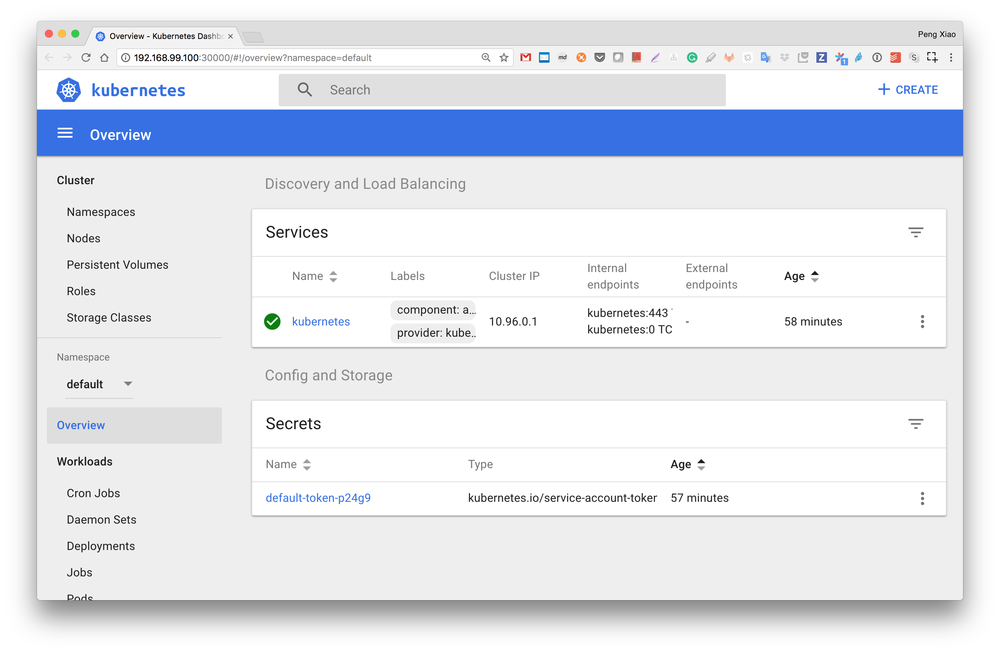

# Minikube(MacOS)

https://github.com/kubernetes/minikube

## Install

follow this guide

https://kubernetes.io/docs/tasks/tools/install-minikube/

### install a Hypervisor

we will chose VirtualBox

### Install kubectl

follow this guide https://kubernetes.io/docs/tasks/tools/install-kubectl/


```
$ curl -LO https://storage.googleapis.com/kubernetes-release/release/$(curl -s https://storage.googleapis.com/kubernetes-release/release/stable.txt)/bin/darwin/amd64/kubect
$ chmod +x ./kubectl
$ sudo mv ./kubectl /usr/local/bin/kubectl
```

### Install Minikube

https://github.com/kubernetes/minikube/releases

```
$ curl -LO https://github.com/kubernetes/minikube/releases/download/v0.26.1/minikube-darwin-amd64
$ chmod +x minikube-darwin-amd64
$ sudo mv minikube-darwin-amd64 /usr/local/bin/minikube
$ minikube version
$ minikube version: v0.26.1
```

## start

```
minikube start
Starting local Kubernetes v1.10.0 cluster...
Starting VM...
Downloading Minikube ISO
 150.53 MB / 150.53 MB [============================================] 100.00% 0s
Getting VM IP address...
Moving files into cluster...
Downloading kubelet v1.10.0
Downloading kubeadm v1.10.0
Finished Downloading kubeadm v1.10.0
Finished Downloading kubelet v1.10.0
Setting up certs...
Connecting to cluster...
Setting up kubeconfig...
Starting cluster components...
Kubectl is now configured to use the cluster.
Loading cached images from config file.
```

## test

$ kubectl get nodes
NAME       STATUS    ROLES     AGE       VERSION
minikube   Ready     master    56m       v1.10.0

## dashboard

```
$ minikube dashboard
Opening kubernetes dashboard in default browser...
```


